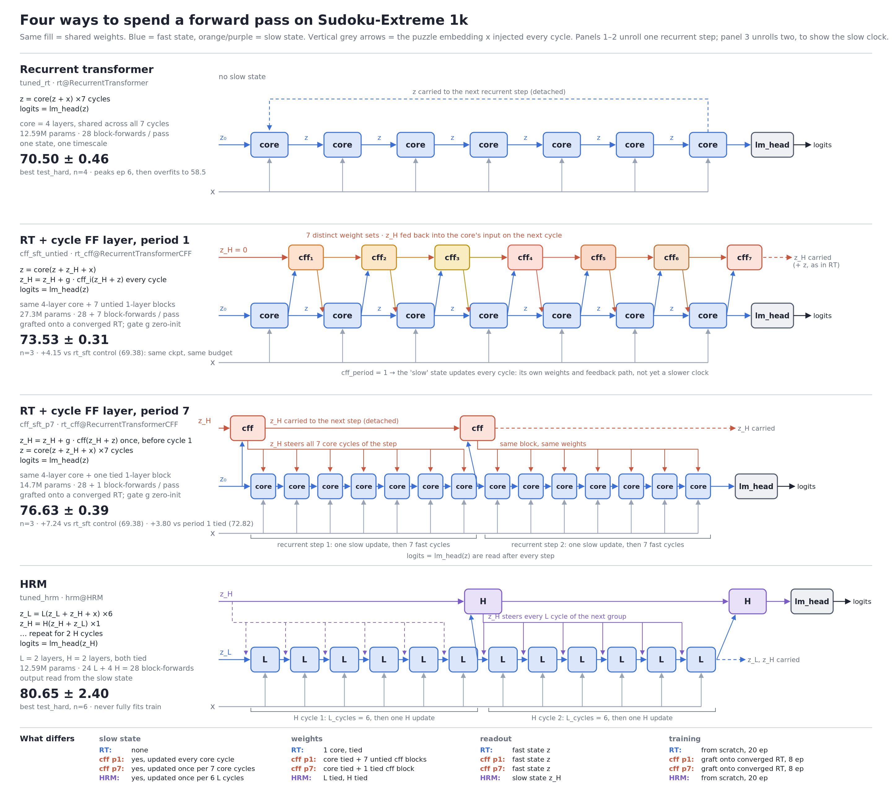
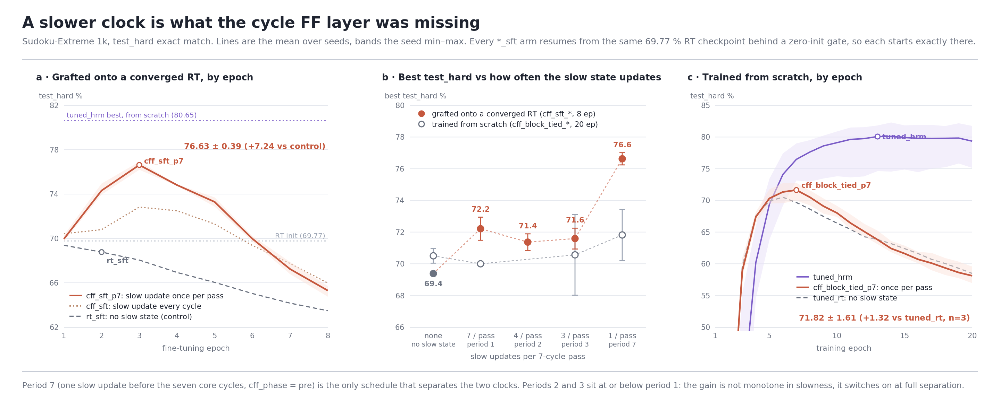

# What a cycle FF layer is, and what it actually bought

A companion to `CYCLE_FF.md`. That file is the lab notebook — configs, commands, per-epoch curves.
This one explains the idea, the code that implements it, and what the experiments concluded.

---

## 1. The gap this is trying to explain

On Sudoku-Extreme 1k, HRM beats a recurrent transformer that is matched on **both** parameters
(12.59M) and block-forwards per pass (28):

| | best `test_hard` | at epoch | final |
|---|---|---|---|
| `tuned_hrm` (n=6) | 80.65 ± 2.40 | 11–19 | 79.4 |
| `tuned_rt` (n=4) | 70.50 ± 0.46 | 6 | 58.5 |

Eleven points, with no parameter or FLOP advantage on either side. The remaining difference is
*structural*: HRM runs a second, slower block (its "H level") between groups of fast cycles, while
the RT applies one identical core every cycle.

**The critical detail is what kind of gap it is.** The RT hits train exact-match 1.000 by epoch 6
and then overfits downhill for 14 epochs. HRM never fully fits the 1000 training puzzles and keeps
climbing. So this is a **generalisation** gap, not a capacity gap. That single fact drives
everything below: it is why adding parameters is not obviously the right medicine, and why every
comparison uses `best` rather than `last`.

## 2. The idea

Give the recurrent transformer the one thing it structurally lacks — a second state that updates on
a slower schedule than the core — and see how much of the 11 points comes back. The added component
is a **cycle FF layer**.



`arch/rt_cff.py`, class `RecurrentTransformerCFF`. The plain RT is `z = core(z + x)` repeated
`cycles` times. The figure shows the two placements that were run — the original period-1 arm
(panel 2, one update per cycle) and the period-7 arm (panel 3, unrolled over two recurrent steps so
the slow clock is visible). The loop, in the form the best arm (`cff_sft_p7`) uses, is:

```
for i in 0..cycles-1:                     # cycles = 7
    if i % cff_period == 0:               # cff_period = 7: once, before cycle 0
        z_H = z_H + g · cff(z_H + z)      # slow state update
    z = core(z + z_H + x)                 # fast state: 4 shared layers, as before
logits = lm_head(z)
```

With `cff_period = 7` that is exactly one HRM H-step followed by seven L-steps. With
`cff_period = 1` — every arm run before 2026-09-15 — the slow update fires every cycle, and the
two states differ only in their weights and feedback path, not in their clock.

Two things make `z_H` a genuinely separate timescale rather than just extra depth:

1. It is **fed back into the core's input** on the next cycle, so it steers the fast computation
   instead of just post-processing it.
2. It is **carried across recurrent steps** (detached, like the RT's own `z`), so it persists beyond
   a single forward pass.

The `inline` mode is the ablation that removes both properties — it writes straight into the fast
state (`z = z + g * cff(z)`) and carries nothing — which separates "second timescale" from "more
depth per cycle".

## 3. The knobs

| config key | meaning |
|---|---|
| `cff_layers` | layers per cycle FF layer. **0 disables it**, leaving the plain RT — this is how the controls are built |
| `cff_type` | `mlp` = post-norm feed-forward, no attention. `block` = full transformer block, i.e. what HRM's H level actually is |
| `cff_intermediate_size` | FF width of the cycle FF layer (default: the core's) |
| `cff_tied` | `True` = one layer shared across all cycles (HRM ties its H level). `False` = one per cycle |
| `cff_period` | run the layer every N core cycles (HRM's `L_cycles` per H cycle) |
| `cff_phase` | `post` = the slow update closes a group of N cycles (the original placement). `pre` = it opens the group, cycle 0 of the pass included. **Required for `cff_period > 1`** — see below |
| `cff_mode` | `inject` = maintain the slow state `z_H`. `inline` = write into the fast state, carry nothing |
| `cff_gated` | wrap in a zero-init per-channel gate |
| `cff_lr_mult` | LR multiplier for the cycle FF parameters vs the rest of the model |
| `pretrained_ckpt` / `freeze_core` | resume from a trained RT; optionally freeze core + embed + lm_head |

Three of these deserve more than a table row.

**`cff_phase` exists because `cff_period` was silently broken for the case that matters.** With
the original `post` placement the slow update runs *after* a core cycle, so at `cff_period = 7` the
only application sits after the seventh cycle: it writes into the carry (detached) and nothing
else. The logits never see it, and the layer receives **exactly zero gradient** — verified before
any period-7 arm was launched. `pre` moves the application to the start of the group, so every
application feeds the pass's own readout and any period trains. At period 1 the two placements
are within noise of each other (72.82 vs 72.21), so `pre` is not itself the effect.

**`cff_gated` is what makes the graft measurable.** With the gate zero-initialised and `z_H`
starting at exactly zero, a run resuming from a pretrained RT begins *bit-for-bit identical* to that
checkpoint — verified `max|logit diff| = 0`. So "did the cycle FF layer help?" is answerable
directly against the checkpoint's own accuracy, with no confound from a perturbed starting point.
Training from scratch there is nothing to preserve, so the gate is off by default.

**`cff_tied` costs parameters but not FLOPs.** `block_tied` and `block_untied` do exactly the same
arithmetic per pass; untying only stops the seven cycles from sharing weights. That makes the pair a
clean test of whether the slow state wants a cycle-specific update schedule.

## 4. Two settings, and why they are not the same experiment

**From scratch.** Train the whole thing — core and cycle FF layer together — from random init, with
everything else matched to `tuned_rt`. Asks: does the structure help a model that has to learn the
task from nothing?

**Grafted (`*_sft`).** Take a *converged* RT checkpoint, splice in a zero-gated cycle FF layer, and
fine-tune. Asks a narrower question: given a model that has already plateaued and started
overfitting, does adding a slow timescale give it somewhere new to go?

The graft gets a second training budget the from-scratch arms do not, so it is **not** comparable to
`tuned_rt` directly. That is the entire reason `rt_sft` exists: the same checkpoint, resumed for the
same budget, with `cff_layers: 0` so the model is a plain RT again. Treatment and control differ in
exactly one thing. Any gain over that control is the layer, not the extra epochs.

## 5. What happened

### From scratch — nothing works

| arm | params | vs RT | best | @ep | last |
|---|---|---|---|---|---|
| `tuned_rt` (baseline, n=4) | 12.59M | — | **70.50 ± 0.46** | 6 | 58.5 |
| `cff_mlp_tied` (n=1) | 13.64M | +8.3 % | 68.89 | 7 | — |
| `cff_block_tied` (n=1) | 14.69M | +16.7 % | 70.00 | 6 | 57.9 |
| `cff_mlp_untied` (n=1) | 19.93M | +58.3 % | 69.71 | 5 | 38.7 |
| `cff_block_untied` (n=3) | 27.27M | +116.6 % | 69.95 ± 2.57 | 6 | 31.7 |

`cff_block_untied` looked like the exception at n=1 (71.93, +1.43 over the RT mean). **Replicated at
three seeds it gives 71.63 / 71.23 / 66.99 — 69.95 ± 2.57, which is 0.55 *below* baseline.** The
original run was a lucky seed.

What the extra parameters reliably buy is variance: a 2.57 seed spread against the RT's own 0.46,
from an arm whose seeds otherwise agree closely on peaking at epoch 6. The late collapse replicated
on every seed (~30 % at ep20 vs the RT's 58 %). On a generalisation gap, more capacity behaves
exactly as you would expect it to.

### Grafted — this one works

All six runs below resume from the same checkpoint (0.6977 on `test_hard`), zero-gated, so each
provably starts there:

| arm (n=3 each) | best | @ep | last | vs init |
|---|---|---|---|---|
| **`cff_sft`** — `inject`, core fine-tuned | **72.82 ± 0.50** | 3 | 66.0 | **+3.05** |
| `rt_sft` — no cycle FF (control) | 69.38 ± 0.10 | 1 | 63.5 | −0.39 |

**+3.44 for the layer over its matched control.** The two arms do not overlap at any seed, and each
is internally tight — an order of magnitude tighter than the from-scratch arm. The curve *shapes*
differ as much as the peaks: every `cff_sft` seed climbs above its init and peaks at epoch 3, every
`rt_sft` seed peaks at epoch 1 *below* its init and only decays from there.

That last point is the one worth holding onto: **the second training budget on its own makes the
model worse.** Resuming a converged, already-overfitting RT and training it further is a losing
move. The cycle FF layer is what converts that same budget into a gain.

### The mechanism, narrowed by two ablations

| arm | best | @ep | vs init |
|---|---|---|---|
| **`cff_sft_untied`** (n=3) | **73.53 ± 0.31** | 2 | **+3.76** |
| `cff_sft` (n=3) | 72.82 ± 0.50 | 3 | +3.05 |
| `cff_sft_lr10` (n=1) | 69.87 | 1 | +0.10 |

`cff_sft_lr10` trains the cycle FF layer 10× faster than the core it is grafted onto. The
hypothesis was benign: a randomly-initialised layer sitting behind a zero gate might simply be
undertrained at a converged backbone's learning rate.

**Instead, 10× erases the entire gain** — 69.87, and the curve collapses onto the no-layer control's
shape exactly (peak at epoch 1, monotone decay). Two readings fall out:

- It is **not** undertraining. Training it harder is strictly worse.
- It is **not** simply added capacity, either. Capacity trained faster should have helped more, not
  less. What the layer needs is to **co-adapt with the core at the same rate** — the core has to
  move to meet it. A slow state the backbone has not adjusted to is worth nothing.

`cff_sft_untied` gives each cycle its own layer instead of sharing one across all seven — 14.7M
added parameters against tied's 2.1M, at **identical FLOPs**. At three seeds (73.61 / 73.19 / 73.80)
it was the best period-1 configuration: **73.53 ± 0.31, +4.15 over the matched control.**

But the margin over tied `cff_sft` is +0.71 and is *not* established at this sample size: the seed
ranges still touch (untied's worst 73.19 against tied's best 73.27), and a Welch t-test gives
t≈2.1, p≈0.12. What untying does change reliably is *speed* — every untied seed peaks at epoch 2,
every tied seed at epoch 3. The read is that per-cycle layers mostly buy faster adaptation rather
than a higher ceiling, which is a weak reason to pay 7× the parameters. HRM ties its H level, and
nothing here contradicts that choice.

### Then the slow clock — this is the result

Everything above shares one omission: with `cff_period: 1` the cycle FF layer fires every cycle,
so the "slow" state was never slower than the fast one. It had its own weights and its own
feedback path, but the same clock. HRM's H level runs once per *six* L steps. The 2026-09-15 sweep
gives the layer that clock — `cff_period ∈ {1, 2, 3, 7}` on the `cff_sft` graft, all at
`cff_phase: pre`, all with the same tied 1-layer block, so parameters and FLOPs are held fixed
across the arms.



| arm (n=3 each, same 69.77 init) | slow updates per pass | best | @ep | vs control |
|---|---|---|---|---|
| `rt_sft` — control | 0 | 69.38 ± 0.10 | 1 | — |
| `cff_sft_pre` — period 1 | 7 | 72.21 ± 0.73 | 4 | +2.83 |
| `cff_sft_p2` | 4 | 71.37 ± 0.52 | 5 | +1.99 |
| `cff_sft_p3` | 3 | 71.59 ± 0.66 | 4.7 | +2.21 |
| **`cff_sft_p7`** — period 7 | **1** | **76.63 ± 0.39** | 3 | **+7.25** |

**One slow update per pass gives 76.63 ± 0.39 — +7.25 over the matched control and +3.8 over the
best period-1 arm, at 2.1M added parameters and six *fewer* block-forwards per pass than period 1.**
The seeds are 76.92 / 76.77 / 76.19, tighter than any other cycle-FF arm. Panel (a) shows what
changed: the period-7 arm moves +4 points in its *first* fine-tuning epoch (69.8 → 74–75 on every
seed) where period 1 moves +1, then peaks at epoch 3 near 77. The control never rises above its
init at all. Same checkpoint, same budget, same layer — only the clock differs.

Two things make this more than a lucky knob setting:

- **The placement is not the effect.** `cff_sft_pre` is period 1 with the same `pre` placement
  the period-7 arm needs, and it is within noise of the original `cff_sft` (72.21 vs 72.82).
- **The effect is not monotone in slowness.** Periods 2 and 3 are *worse* than period 1 (panel b).
  Updating the slow state three or four times per pass gives neither the extra per-cycle depth of
  period 1 nor the clean per-pass context of period 7. The gain switches on at full separation —
  which is the regime HRM operates in.

From scratch (panel c) the same schedule helps far less. `cff_block_tied_p7` reaches 71.82 ± 1.61
against the RT's 70.50, +1.32, but the third seed (69.96) is a null and Welch's t≈1.4 (p≈0.28)
does not establish the mean. The 1k from-scratch regime is, as before, too noisy and too
overfitting-dominated to settle a structural claim; the graft is where the comparison is clean.

## 6. So how much of the 11 points came back?

About seven, in the graft setting. `cff_sft_p7` at 76.63 sits 4 points short of HRM's 80.65
from a control of 69.38 — roughly two-thirds of the gap, recovered from a checkpoint that had
already converged and started to overfit, by a single tied 1-layer block updated once per pass.
The honest summary:

- **The slow timescale is what the cycle FF layer was missing.** At period 1 the layer was worth
  +3.4; giving it a genuinely slower clock doubles that to +7.3, replicated, with non-overlapping
  seeds and both the placement and the intermediate periods controlled.
- **It is a large part of what makes HRM work, but not all of it.** Four points remain. HRM also
  reads its output from the slow state, trains the H block from scratch alongside L, and has two H
  steps per pass; none of those has been tested here. From scratch the effect is small and noisy,
  so the claim is specifically about the *schedule*, not about training dynamics from init.
- **Everything here is measured on a generalisation gap on 1000 puzzles.** Every arm peaks by epoch
  3–6 and then overfits. That is a narrow regime to draw architectural conclusions from, and it is
  why the full Sudoku-Extreme graft is the most valuable untried experiment: on full data nothing
  overfits, and the question becomes capability rather than memorisation.

## 7. What changed in each session

### 2026-09-15 — the timescale sweep

Ran `cff_sft_p7`, `cff_sft_p3`, `cff_sft_pre`, `cff_sft_p2` (8 ep, 3 seeds each) and
`cff_block_tied_p7`, `cff_block_tied_p3` (20 ep, 3 seeds each) — 6.5 h on 8 H100s, all exit 0.

- **`arch/rt_cff.py`** — added `cff_phase` (`pre` / `post`). The `post` default is bit-identical
  to the previous code on the existing `cff_sft` checkpoint (`max|logit diff| = 0`); `pre` is what
  makes `cff_period > 1` trainable. First-pass `z` is now broadcast to the batch shape before the
  loop, since a `pre` application sees it before the core would have.
- **Six configs** — `config/cff_sft_{p7,p3,p2,pre}.yaml`, `config/cff_block_tied_{p7,p3}.yaml`.
- **`experiments/make_cff_figure.py`** — regenerates both figures from pasted numbers; `cycle_ff_architectures.png`
  gained a period-7 panel (two recurrent steps unrolled) between the period-1 and HRM panels, and
  `cycle_ff_timescale.png` is new.
- **Section 5–6 of this file** rewritten around the period-7 result.

### 2026-09-10 — the replication queue

Ran the replication queue — `cff_block_untied`, `cff_sft`, `rt_sft`, `cff_sft_lr10`,
`cff_sft_untied` — 3h40m on 8 H100s, then `cff_sft_untied` at 3 seeds (45 min). All arms exit 0.

- **`CYCLE_FF.md`** — results tables rewritten with n=3 numbers. The from-scratch headline was
  reversed (the +1.43 did not replicate); the graft result was confirmed and strengthened
  (+2.29 → +3.44). Priority list updated to what is actually left.
- **`experiments/collect_cff_results.py`** — `SFT_INIT` corrected 0.7087 → 0.6977. It was
  understating every new `cff_sft` result by 1.1 points.

Two setup facts that cost time and are now documented in `CYCLE_FF.md`:

- **The original 70.87 % checkpoint (`nonchalant-malamute`) no longer exists.** The replication used
  `malachite-saluki` at **0.6977**, the weakest of the four `tuned_rt` seeds. This does not affect
  the `cff_sft` vs `rt_sft` comparison — both resume from the same weights — but it shifts every
  absolute number, so record the init alongside any new resume result.
- **A long-lived tmux server does not inherit your shell's environment.** `run_baselines.sh`
  launches into tmux, so `RT_CKPT` and `uv`'s `PATH` silently fail to propagate and the resume arms
  die on `FileNotFoundError`. Verify what a run actually loaded before trusting it:
  `grep pretrained_ckpt "checkpoints/<arm> <coolname>/seed_1/model_config.json"`.
