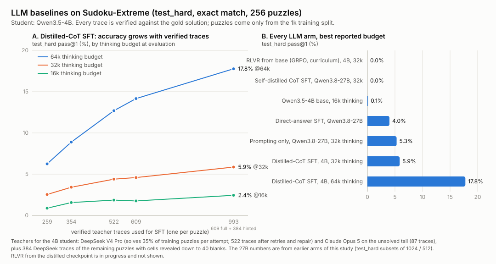

# LLM baselines on Sudoku-Extreme: what we tried and what it got

*Figure: `llm_sudoku_results.svg`, drawn by `make_figure.py` from `sft_scaling.json` and the
`diag/` evals. Metric everywhere: exact match of the full 81-cell grid on the first 256 rows of
`test_hard`, greedy-free sampling at T=1 (pass@1 over 4 samples per puzzle).*

## Question

The from-scratch models in this repo (HRM and its ablations, the transformer and flow arms)
are trained on the 1000 puzzles of `sudoku-extreme-1k`. A natural reviewer question is
"what does a pretrained LLM do with the same 1000 puzzles?" This directory, together with
`baselines/llm_sft`, `baselines/llm_reason` and `baselines/llm_rlvr`, is the answer. Every
arm sees only those 1000 training puzzles (optionally with the repo's own band/stack/digit
augmentation); nothing from `test_hard` is ever used for training, prompting or trace
generation.

## Arms, in the order they were tried

| arm | model | what it does | test_hard pass@1 |
|---|---|---|---|
| Direct-answer SFT (`llm_sft`) | Qwen3.8-27B | emit the 81 digits, no reasoning | 4.0% (plateau by epoch 0.05) |
| Prompting only (`llm_reason`, round 0) | Qwen3.8-27B | think up to 32k tokens, then answer | 5.3% — closes thinking on 6% of puzzles, 80% of those correct |
| Self-distilled reasoning SFT (`llm_reason`) | Qwen3.8-27B | SFT on its own traces, loss on the answer only | collapses to 0%: the trace shrinks from 32k to 81 tokens |
| RLVR from the base (`llm_rlvr`, v1 and v2) | Qwen3.5-4B | GRPO, exact-match reward, hint curriculum | 0% at 8k, 16k and 32k budgets |
| **Distilled-CoT SFT (this directory)** | **Qwen3.5-4B** | SFT on verified teacher traces, loss on reasoning + answer | **17.8% at 64k** (5.9% at 32k, 2.4% at 16k) |
| RLVR from the distilled checkpoint | Qwen3.5-4B | GRPO at 32k, curriculum from 30 blanks | running (`llm_rlvr_from_cot_32k`) |

### Why the earlier arms failed

* The 27B direct-answer SFT memorises augmented views of 1000 puzzles; accuracy stops moving
  after ~1k steps while the loss keeps falling.
* Prompting a 27B thinking model works when it *finishes*, but on Sudoku-Extreme it almost never
  finishes inside 32k tokens. Fine-tuning it on its own truncated traces with an answer-only loss
  taught it that the reasoning was optional, and it dropped the reasoning.
* RL with a verifiable reward can only sharpen what the policy already samples. A 4B base model
  solves 45-blank puzzles at 0% and full 55–64-blank puzzles at 0%, so GRPO had no reward to work
  with beyond ~35 blanks. A hint curriculum got it there quickly (30-blank puzzles: 1% → 92%) and
  then stalled; a format bonus in v1 was hacked ("stop thinking, emit any grid") within ten steps.
  The traces grew steeply with difficulty — a 35-blank puzzle needed ~14k tokens — which is a
  search-depth problem, not a budget problem: 32k evaluation of the 16k-trained arm was still 0%.

### What distillation does differently

The student is given *reference reasoning*. A strong API model is asked the exact prompt the
student sees, its answer is checked against the gold solution, and only traces whose final grid
is exactly right are kept. The student is then fine-tuned on `[prompt | <think> trace </think> |
grid]` with the loss on the whole completion, so it learns how to reason, not merely to read off
an answer. Training details: full fine-tune, FSDP2, Liger fused cross-entropy (the 248k-vocab
logits of a 100k-token trace would otherwise be ~100 GB), sequences up to 128k tokens, batch 32,
lr 1e-5, 2 epochs.

## The teacher data

| source | puzzles attempted | traces kept | notes |
|---|---|---|---|
| DeepSeek V4 Pro, up to 130k thinking tokens | 1000, up to 3 attempts | 506 | 35.4% solved on the first attempt; the second and third attempts add ~10% of the remainder each |
| DeepSeek, trace *repair* | 331 wrong traces | +27 | cut the trace at its first committed wrong placement (found against the gold, not by a model), let the teacher continue, keep only if exact |
| Claude Opus 5, visible derivation | 189 of the unsolved puzzles, easiest rating first | +87 | 46% yield; the only model of nine tried that solved rating-30 puzzles |
| DeepSeek, hinted puzzles (40 blanks left) | the 478 puzzles still unsolved | 471 (384 used) | the same puzzles with cells revealed from their own solution — the difficulty band where the student breaks |

Total: **609 puzzles with a verified full-difficulty trace** (61% of the split), 384 more with a
hinted trace, one trace per puzzle at training time. Solvability tracks the dataset's own
difficulty rating exactly: rating 0 (no backtracking) 100% solved by DeepSeek, rating 1–9 65%,
rating 10+ 30%. The unsolved tail is the search-heavy half of Sudoku-Extreme, and even a frontier
reasoning model with 130k tokens and three tries does not get there.

Models probed on two rating-30 puzzles DeepSeek had failed three times: Claude Opus 5 solved one
(reasoning returned as a summary, so it was re-run in *visible* mode where the derivation is the
output); GPT-6 Astra 0/2 (reasoning encrypted); Grok 4.6, GLM-5.3, MiniMax M3, Qwen3.8-2.4T,
Kimi K3 all 0/2.

Costs: DeepSeek ~$210 for the 1000 first attempts via OpenRouter, negligible on the native API
for the retries and hinted set; Opus $980 for 87 traces (~$11 per trace).

## Scaling (panel A)

| traces | 16k | 32k | 64k | pass@4 @64k | 45-blank puzzles @16k |
|---|---|---|---|---|---|
| 259 | 0.9% | 2.5% | 6.2% | 13.7% | 25% |
| 354 | 1.6% | 3.4% | 8.9% | 17.2% | 37% |
| 522 | 1.9% | 4.4% | 12.7% | 21.5% | 46% |
| 609 (+Opus) | 1.8% | 4.6% | 14.2% | 23.0% | 54% |
| 609 + 384 hinted | 2.4% | 5.9% | **17.8%** | **25.8%** | 61% |

Three things to read off it:

1. **It scales with the number of verified traces and has not saturated.** Roughly linear from
   259 to 993 traces at every budget.
2. **The student needs room to think.** The same checkpoint scores 2.4% at 16k, 5.9% at 32k and
   17.8% at 64k; teacher traces have a median of ~50k tokens. Of the traces that finish inside the
   budget, 98% are correct — the binding constraint is finishing.
3. **Hinted traces help on the full puzzles**, even though they are easier: +3.6 points at 64k,
   and the 45-blank success rate rises to 61%. They cover exactly the puzzles for which no
   full-difficulty trace exists.

## Where this leaves the comparison

The best LLM number we have is a 4B model at 17.8% (25.8% pass@4) with 64k tokens of thinking
per puzzle, after ~$1.2k of teacher traces on top of the 1000 training puzzles. That is well
above every other LLM configuration tried, including the 27B arms, and it is still a long way
from the from-scratch models in this repo on the same split. RLVR from this checkpoint is the
one remaining lever with a clear mechanism — the student's failures are almost entirely traces
that do not finish, and RL on the base model demonstrably shortened traces — and is running.

## Files

* `make_figure.py`, `sft_scaling.json`, `llm_sudoku_results.svg` — this figure and its data
* `../generate.py` — teacher traces (OpenRouter or DeepSeek native; visible-derivation mode;
  retries; hinted variants; provider pinning — several OpenRouter hosts cap reasoning at 32k)
* `../repair.py` — cut-and-continue repair of wrong traces
* `../train.py`, `../run.sh` — SFT and the evaluation protocol (`baselines/llm_rlvr/diag.py`)
* traces: `cot/deepseek_deepseek-v4-pro/{train,repair,train_hinted40}.jsonl`,
  `cot/anthropic_claude-opus-5/train.jsonl`; checkpoints under `checkpoints/llm_cot_qwen3.5_4b*`;
  evals under `diag/llm_cot_qwen3.5_4b*/`
